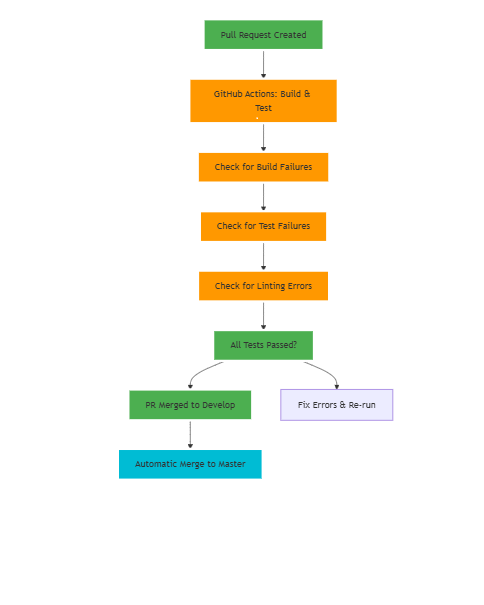

# FlakeShield — Architecture (MVP + Guardrailed Extensions)

Purpose: reduce CI noise via **deterministic, explainable** post-test analysis.
Default shape: **CLI-first**, local-first, DB-backed, reproducible.

Legend:
- [ ] component
- ( ) data artifact
- --> flow
- * deterministic / authoritative
- ~ ML-assisted / optional (non-authoritative)

------------------------------------------------------------
NOW (MVP shipped): CLI + SQLite + deterministic core (+ ML assist)
------------------------------------------------------------

(pytest run N) --> (JUnit XML: report_runN.xml)
                     |
                     v
            [CLI Entry: flakeshield] *
                     |
                     v
            [Ingestion Pipeline] *
            - discover report files (glob/paths)
            - assign run_id per report
            - parse JUnit XML to canonical events
                     |
                     v
         [Canonical Events: List[TestCase]] *
            - run_id, suite, test_id, status
            - duration_sec, failure_type
            - message, traceback
            - fingerprint (computed next)
                     |
                     v
           [Fingerprint Builder] *
           - normalize message/traceback
             (strip volatile tokens: ids, paths, line nums, timestamps)
           - produce stable fingerprint string
                     |
                     v
           [SQLite Persistence: flakeshield.db] *
           - idempotent inserts (UNIQUE(run_id, test_id))
           - stored rows are the source of truth
           - tables: test_results (primary), failure_embeddings (Week 4, reserved)

                     |
                     v
          [DB-only Analytics Layer] *
          +------------------------------+-----------------------------+------------------------------+
          |                              |                             |                              |
          v                              v                             v
 [Flake Detection (multi-run)] *   [Failure Groups by fingerprint] *   [Scoring + confidence] *
 - pass/fail variance per test_id  - group failed/error by fingerprint - run count thresholds
 - flaky rate + stability          - counts + representative failure    - explainable confidence

                     |
                     v
        [Semantic Failure Grouping] ~ (assistive, reversible, gated)
        - embed failure text (message/traceback)
        - group by cosine similarity threshold (default 0.80)
        - never replaces fingerprint groups; adds an extra view
        - evaluated via fragmentation metrics
        - enabled via --enable-semantic flag (non-blocking on failure)

                     |
                     v
              [Report Builder] *
              - JSON report (machine)
              - Markdown report (human)
              - includes:
                - deterministic results (primary)
                - ML-assisted semantic groups (clearly labeled)
                - metrics: fingerprint_group_count, semantic_group_count, fragmentation_delta

**Database Schema (Week 4):**

- `test_results` (authoritative)
  - run_id, test_id, status, message, traceback, fingerprint, ...
  - UNIQUE(run_id, test_id) for idempotent inserts
  - Indexes: run_id, test_id, status, fingerprint

- `failure_embeddings` (reserved for future use)
  - fingerprint, model_name, dim, vector, created_at
  - UNIQUE(fingerprint, model_name)
  - *Currently not written to by semantic grouping (no persistence yet)*

Artifacts:
- outputs/flake_report.json (JSON report: deterministic + semantic)
- outputs/flake_report.md (Markdown report: human-readable)
- outputs/flakeshield.db (SQLite: source of truth)

Operating guarantees:
- Deterministic core always runs
- ML assist is optional and must be clearly labeled
- No CI blocking decisions based on ML
- Reports are a view over DB state (not filesystem state)

------------------------------------------------------------
NEXT (near-term, still MVP-aligned): CI integration, not product expansion
------------------------------------------------------------

(1) CI Integration (GitHub Actions / CI step)
--------------------------------------------
[CI job]
  - run tests
  - produce junitxml artifact(s)
  - run flakeshield CLI
  - upload report artifacts / optional PR summary comment

(2) Trend Views (still deterministic)
-------------------------------------
- flake rate over time per test_id
- top noisy fingerprints
- “new failure groups since last run”
- allowlist / ignore rules (config file)

(3) Decision Gate for ML persistence (NOT NOW)
----------------------------------------------
Only consider storing embeddings when:
- semantic grouping repeatedly reduces fragmentation on real projects
- performance cost justifies caching
- correctness risk is understood and bounded

------------------------------------------------------------
PARKED (explicitly not MVP)
------------------------------------------------------------
- UI / dashboards
- orchestration / auto-quarantine / auto-reruns
- model training / fine-tuning
- RAG / LLM explanations (until MVP value is proven + data exists)
- test generation / smart selection workflows

Note:
- The DB is the canonical artifact. Reports are derived outputs.
